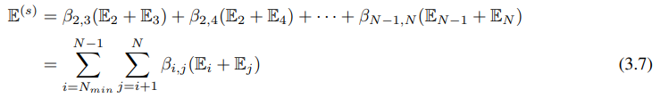

# 概要
筑波大学大学院博士課程 理工情報生命学術院 システム情報工学研究群修士論文  
[微分可能なニューラルアーキテクチャサーチにおけるモデル圧縮](./assets/202320650_三浦隼_修士論文本体.pdf)

セルベース、勾配ベースのNeural Architecture Searchを用いた、ネットワーク規模を調整可能な構造探索手法を提案する。


ステージレベル構造の探索に「深さ期待値損失」を導入することにより、ステージレベル構造におけるセルの数を制御することで、探索するネットワークの規模の柔軟な調整を実現した。  
また「継続的学習」を採用することで、最終的に得られるネットワークの精度向上を実現した。

このコードは、次の２つの実装に基づいて実装を行った。
- [DARTS](https://github.com/quark0/darts)
- [PC-DARTS](https://github.com/yuhuixu1993/PC-DARTS)

# Usage
どのプログラムも多くの引数を受け付けるため、shellスクリプト`.sh`の使用を推奨する。
### 継続的学習によるステージ構造の探索と評価 on CIFAR100
|引数名|意味|
|---|---|
|{experiment_name}|実験名|
|{genotype}|セルレベル構造の構造名(default:"BASELINE_BEST")または`.pickle`ファイルパス|
|{g}|深さ期待値損失の係数γの値（継続的学習の場合はγ=0(default)、深さ期待値損失を使用する場合は0以外の値に変更する。）|
|{layers}|ネットワークのセル数|
|{epoch}|探索段階のエポック数(default:10)|
|{eval_epoch}|評価段階のエポック数(default:100)|
|{curri_eposh}|カリキュラム的探索の分割エポック数(default:0 50)|
```
python searchStage_main.py \\
    --type SearchEvalCurriculum \\
    --name {experiment_name} \\
    --genotype {genotype} \\
    --g {g}\\
    --layers {layers} \\
    --epochs {epoch} \\
    --eval_epochs {eval_epoch} \\
    --curriculum_epochs {curri_epoch} \\
    --dataset cifar100\\
    --advanced 1
```
### 深さ期待値損失による探索のみ on CIFAR100
```
python searchStage_main.py \\
    --type Pruning \\
    --name {experiment_name} \\
    --genotype {genotype} \\
    --g {g>0}\\
    --layers {layers} \\
    --dataset cifar100\\
    --advanced 1
```
### 探索した構造の評価 on CIFAR100
探索した構造をクロスエントロピー損失でスクラッチから学習する
|引数名|意味|
|---|---|
|{genotype}|セルレベル構造の構造名(default:"BASELINE_BEST")または`.pickle`ファイルパス|
|{dag}|ステージレベル構造の構造名または`.pickle`ファイルパス|
```
python evaluateStage_main.py \\
    --name {name} \\
    --genotype {genotype} \\
    --DAG {dag} \\
    --layers {layer}\\
    --dataset cifar100
```
# 提案手法
## 「継続的学習」
探索段階で獲得した重みを評価段階で継承する。

従来の勾配ベースのNASでは、探索段階で得られた重みはランダムに初期化されてから評価段階の学習を行っていたが、継続的学習を行うことで効果的に評価段階の学習を行うことが可能になる。
<p align="center">


</p>

### Results on CIFAR100
<p align="center">


</p>

## 「深さ期待値損失」
探索中のステージレベル構造の**平均的な**深さを評価する深さ期待値損失を、構造パラメータの最適化に導入する

ステージレベルの探索空間であるDAGを以下のように定義する。
<p align="center">


</p>
各ノード、ステージ、ネットワーク全体の深さ期待値を以下のように定義する。
<p align="center">



</p>

### Results on CIFAR100
<p align="center">


</p>

## 今後の課題(To Do)
### 正則化手法の導入
継続的学習は、探索段階と評価段階のネットワークのパラメータを変化させることができないため、評価段階においてDropPath,AuxiliaryHeadを導入することができない。
また従来の勾配ベースのNASでは、探索段階は少ないチャンネル数で軽量な探索を実現し、評価段階ではチャンネル数を増加させることで学習するネットワークの汎化性能を向上させている。

汎化性能を向上させるため、継続的学習をする条件においてもDropPath,AuxiliaryHead,チャンネル数の増加を行う方法を探求する。
### 構造離散化
継続的学習を行う条件下で、構造離散化の際にモデルの写像関係が変化するため学習が一時的に阻害される問題がある。
### 深さ期待値損失
深さ期待値損失を導入して32セルネットワークの探索空間から探索する条件と、クロスエントロピー損失のみで11セルネットワークの探索空間から探索する条件では、小さい空間から探索したほうが、最終的な精度がよくなった。

大きい探索空間で探索する場合は、探索段階のエポック数を多くするなど、工夫が必要である。

## Citation
```
@masterthesis{miura2025nas,
  title={微分可能なニューラルアーキテクチャサーチにおけるモデル圧縮},
  author={Shun, Miura},
  school={University of Tsukuba},
  year={2025}
}
```

## LICENSE

This project is licensed under the Creative Commons Attribution-NonCommercial 4.0 International License (CC BY-NC 4.0).

- You may not use this work for commercial purposes.
- You must give appropriate credit, provide a link to the license, and indicate if changes were made.
- Full license text: https://creativecommons.org/licenses/by-nc/4.0/

Please use this code only for non-commercial purposes.